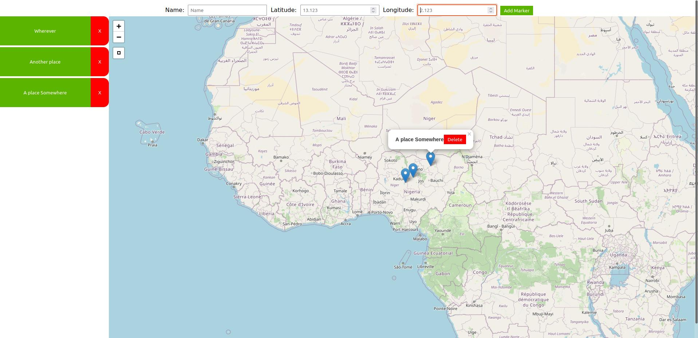

# Django Leaflet Implementation

This is a small playground for testing out leaflet in a django fullstack setup.
It is only meant to try out the functionalities regarding view position and marker handling.
So, forgive the ugly design around it.
I did a techstack comparison to a similar project in react, which can be
found [here](https://github.com/Schulzjo/react_leaflet_implementation).

